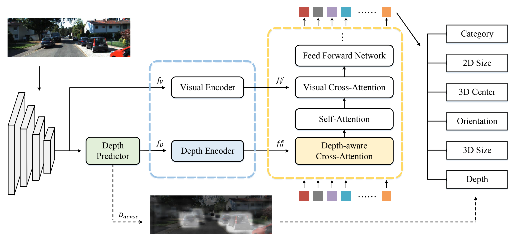

# MonoDETR: Depth-guided Transformer for Monocular 3D Object Detection
Official implementation of the paper ['MonoDETR: Depth-guided Transformer for Monocular 3D Object Detection'](https://arxiv.org/pdf/2203.13310.pdf).

## Introduction
MonoDETR is the **first DETR-based model** for monocular 3D detection **without additional depth supervision, anchors or NMS**, which achieves leading performance on KITTI *val* and *test* set. We enable the vanilla transformer in DETR to be depth-aware and enforce the whole detection process guided by depth. In this way, each object estimates its 3D attributes adaptively from the depth-informative regions on the image, not limited by center-around features.
<div align="center">
  
</div>

## Main Results
The randomness of training for monocular detection would cause the variance of ±1 AP<sub>3D</sub>. For reproducibility, we provide four training logs of MonoDETR on KITTI *val* set for the car category: (the stable version is still under tuned)

<table>
    <tr>
        <td rowspan="2",div align="center">Models</td>
        <td colspan="3",div align="center">Val, AP<sub>3D|R40</sub></td>   
        <td rowspan="2",div align="center">Logs</td>
    </tr>
    <tr>
        <td div align="center">Easy</td> 
        <td div align="center">Mod.</td> 
        <td div align="center">Hard</td> 
    </tr>
    <tr>
        <td rowspan="4",div align="center">MonoDETR</td>
        <td div align="center">28.84%</td> 
        <td div align="center">20.61%</td> 
        <td div align="center">16.38%</td> 
        <td div align="center"><a href="https://drive.google.com/file/d/124u2WW_DqDyKrpUe3lQ8TR6xth8rn9YH/view?usp=sharing">log</a></td>
    </tr>  
    <tr>
        <td div align="center">26.66%</td> 
        <td div align="center">20.14%</td> 
        <td div align="center">16.88%</td> 
        <td div align="center"><a href="https://drive.google.com/file/d/1gSof60oOnno_qAHRViXKQ6CyqRI7O0tr/view?usp=sharing">log</a></td>
    </tr> 
    <tr>
        <td div align="center">29.53%</td> 
        <td div align="center">20.13%</td> 
        <td div align="center">16.57%</td> 
        <td div align="center"><a href="https://drive.google.com/file/d/1rrayzzwHGpddE1f_mfvq0RQb5xpWcPAL/view?usp=sharing">log</a></td>
    </tr> 
    <tr>
        <td div align="center">27.11%</td> 
        <td div align="center">20.08%</td> 
        <td div align="center">16.18%</td> 
        <td div align="center"><a href="https://drive.google.com/file/d/1D6IOkscfypGSEbsXcHZ60-q492zvMLp7/view?usp=sharing">log</a></td>
    </tr> 
</table>

MonoDETR on *test* set from official [KITTI benckmark](http://www.cvlibs.net/datasets/kitti/eval_object_detail.php?&result=22a0e176d4f7794e7c142c93f4f8891749aa738f) for the car category:
<table>
    <tr>
        <td rowspan="2",div align="center">Models</td>
        <td colspan="3",div align="center">Test, AP<sub>3D|R40</sub></td>   
    </tr>
    <tr>
        <td div align="center">Easy</td> 
        <td div align="center">Mod.</td> 
        <td div align="center">Hard</td> 
    </tr>
    <tr>
        <td rowspan="2",div align="center">MonoDETR</td>
        <td div align="center">24.52%</td> 
        <td div align="center">16.26%</td> 
        <td div align="center">13.93%</td> 
    </tr>  
    <tr>
        <td div align="center">25.00%</td> 
        <td div align="center">16.47%</td> 
        <td div align="center">13.58%</td> 
    </tr>  
    
</table>


## Installation
1. Clone this project and create a conda environment:
    ```
    git clone https://github.com/ZrrSkywalker/MonoDETR.git
    cd MonoDETR

    conda create -n monodetr python=3.8
    conda activate monodetr
    ```
    
2. Install pytorch and torchvision matching your CUDA version:
    ```
    conda install pytorch torchvision cudatoolkit
    ```
    
3. Install requirements and compile the deformable attention:
    ```
    pip install -r requirements.txt

    cd lib/models/monodetr/ops/
    bash make.sh
    
    cd ../../../..
    ```
    
4. Make dictionary for saving training losses:
    ```
    mkdir logs
    ```
 
5. Download [KITTI](http://www.cvlibs.net/datasets/kitti/eval_object.php?obj_benchmark=3d) datasets and prepare the directory structure as:
    ```
    │MonoDETR/
    ├──...
    ├──data/KITTIDataset/
    │   ├──ImageSets/
    │   ├──training/
    │   ├──testing/
    ├──...
    ```
    You can also change the data path at "dataset/root_dir" in `configs/monodetr.yaml`.
    
## Get Started

### Train
You can modify the settings of models and training in `configs/monodetr.yaml` and appoint the GPU in `train.sh`:

    bash train.sh configs/monodetr.yaml > logs/monodetr.log
   
### Test
The best checkpoint will be evaluated as default. You can change it at "tester/checkpoint" in `configs/monodetr.yaml`:

    bash test.sh configs/monodetr.yaml


## Acknowlegment
This repo benefits from the excellent [Deformable-DETR](https://github.com/fundamentalvision/Deformable-DETR) and [MonoDLE](https://github.com/xinzhuma/monodle).

## Citation
```bash
@article{zhang2022monodetr,
  title={MonoDETR: Depth-aware Transformer for Monocular 3D Object Detection},
  author={Zhang, Renrui and Qiu, Han and Wang, Tai and Xu, Xuanzhuo and Guo, Ziyu and Qiao, Yu and Gao, Peng and Li, Hongsheng},
  journal={arXiv preprint arXiv:2203.13310},
  year={2022}
}
```

## Contact
If you have any question about this project, please feel free to contact zhangrenrui@pjlab.org.cn.
