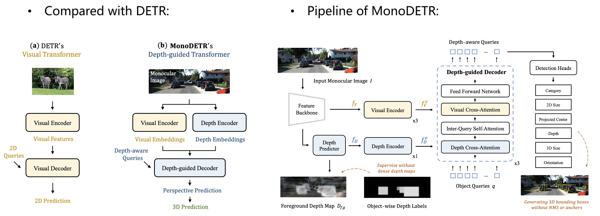

# MonoDETR: Depth-guided Transformer for Monocular 3D Object Detection
Official implementation of ['MonoDETR: Depth-guided Transformer for Monocular 3D Object Detection'](https://arxiv.org/pdf/2203.13310.pdf).

The paper has been accepted by **ICCV 2023** 🎉.

## News
* **[2023-08]** A ***More Stable Version*** 🌟 of MonoDETR on KITTI is now released! 🔥🔥🔥
* **[2022-04]** The initial code of MonoDETR on KITTI is released

## Introduction
MonoDETR is the **first DETR-based model** for monocular 3D detection **without additional depth supervision, anchors or NMS**. We enable the vanilla transformer in DETR to be depth-guided and achieve scene-level geometric perception. In this way, each object estimates its 3D attributes adaptively from the depth-informative regions on the image, not limited by center-around features.
<div align="center">
  
</div>

## Main Results

Note that the randomness of training for monocular detection would cause a variance of ±1 AP<sub>3D</sub> on KITTI.

The official results in the paper:

<table>
    <tr>
        <td rowspan="2",div align="center">Models</td>
        <td colspan="3",div align="center">Val, AP<sub>3D|R40</sub></td>   
    </tr>
    <tr>
        <td div align="center">Easy</td> 
        <td div align="center">Mod.</td> 
        <td div align="center">Hard</td> 
    </tr>
    <tr>
        <td rowspan="4",div align="center">MonoDETR</td>
        <td div align="center">28.84%</td> 
        <td div align="center">20.61%</td> 
        <td div align="center">16.38%</td> 
    </tr>  
</table>

New and better results in this repo:
<table>
    <tr>
        <td rowspan="2",div align="center">Models</td>
        <td colspan="3",div align="center">Val, AP<sub>3D|R40</sub></td>   
        <td rowspan="2",div align="center">Logs</td>
        <td rowspan="2",div align="center">Ckpts</td>
    </tr>
    <tr>
        <td div align="center">Easy</td> 
        <td div align="center">Mod.</td> 
        <td div align="center">Hard</td> 
    </tr>
    <tr>
        <td rowspan="4",div align="center">MonoDETR</td>
        <td div align="center">28.79%</td> 
        <td div align="center">20.83%</td> 
        <td div align="center">17.47%</td> 
        <td div align="center"><a href="https://drive.google.com/file/d/1U2l2nYMOc6pTgASuck1PM9MOCyfEJwwE/view?usp=sharing">log</a></td>
        <td div align="center"><a href="https://drive.google.com/file/d/1d8fbAt-CQF-IN8UEHuw3NimmfONhH6iA/view?usp=sharing">ckpt</a></td>
    </tr>  
  <tr>
        <td div align="center">29.36%</td> 
        <td div align="center">20.64%</td> 
        <td div align="center">17.30%</td> 
        <td div align="center"><a href="https://drive.google.com/file/d/1HbezCRjc8-sut80yPwUdIK8bilV3lyrx/view?usp=sharing">log</a></td>
        <td div align="center"><a href="https://drive.google.com/file/d/1kT17M-IaquLiOG8QNw9n3qCtNsnqk-21/view?usp=sharing">ckpt</a></td>
    </tr>  
  <tr>
        <td div align="center">27.58%</td> 
        <td div align="center">20.14%</td> 
        <td div align="center">16.98%</td> 
        <td div align="center"><a href="https://drive.google.com/file/d/1WqEkIFBVR9iVdGwn4vQ68U0lHXrZp6tQ/view?usp=sharing">log</a></td>
        <td div align="center"><a href="https://drive.google.com/file/d/1EbUpPmRT7AkL-BHOvyM67Wz1GDY_MuJZ/view?usp=sharing">ckpt</a></td>
    </tr>  
</table>


## Installation
1. Clone this project and create a conda environment:
    ```
    git clone https://github.com/ZrrSkywalker/MonoDETR.git
    cd MonoDETR

    conda create -n monodetr python=3.8
    conda activate monodetr
    ```
    
2. Install pytorch and torchvision matching your CUDA version:
    ```bash
    conda install pytorch torchvision cudatoolkit
    # We adopt torch 1.9.0+cu111
    ```
    
3. Install requirements and compile the deformable attention:
    ```
    pip install -r requirements.txt

    cd lib/models/monodetr/ops/
    bash make.sh
    
    cd ../../../..
    ```
    
4. Make dictionary for saving training losses:
    ```
    mkdir logs
    ```
 
5. Download [KITTI](http://www.cvlibs.net/datasets/kitti/eval_object.php?obj_benchmark=3d) datasets and prepare the directory structure as:
    ```
    │MonoDETR/
    ├──...
    ├──data/KITTIDataset/
    │   ├──ImageSets/
    │   ├──training/
    │   ├──testing/
    ├──...
    ```
    You can also change the data path at "dataset/root_dir" in `configs/monodetr.yaml`.
    
## Get Started

### Train
You can modify the settings of models and training in `configs/monodetr.yaml` and indicate the GPU in `train.sh`:

    bash train.sh configs/monodetr.yaml > logs/monodetr.log
   
### Test
The best checkpoint will be evaluated as default. You can change it at "tester/checkpoint" in `configs/monodetr.yaml`:

    bash test.sh configs/monodetr.yaml


## Acknowlegment
This repo benefits from the excellent [Deformable-DETR](https://github.com/fundamentalvision/Deformable-DETR) and [MonoDLE](https://github.com/xinzhuma/monodle).

## Citation
```bash
@article{zhang2022monodetr,
  title={MonoDETR: Depth-guided Transformer for Monocular 3D Object Detection},
  author={Zhang, Renrui and Qiu, Han and Wang, Tai and Xu, Xuanzhuo and Guo, Ziyu and Qiao, Yu and Gao, Peng and Li, Hongsheng},
  journal={ICCV 2023},
  year={2022}
}
```

## Contact
If you have any questions about this project, please feel free to contact zhangrenrui@pjlab.org.cn.
